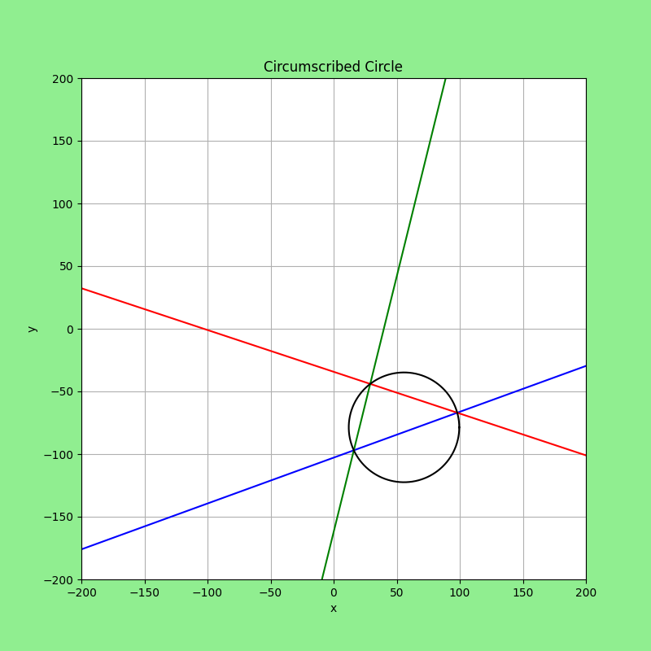
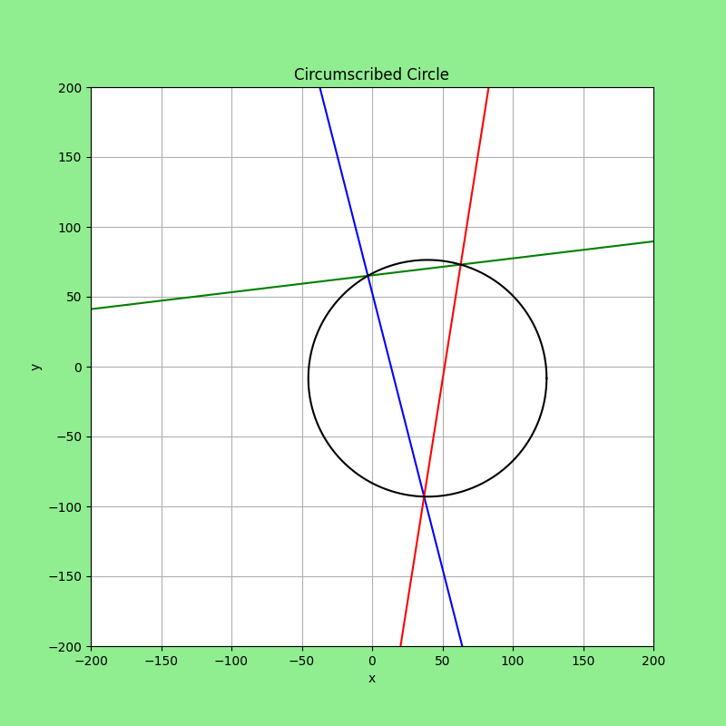
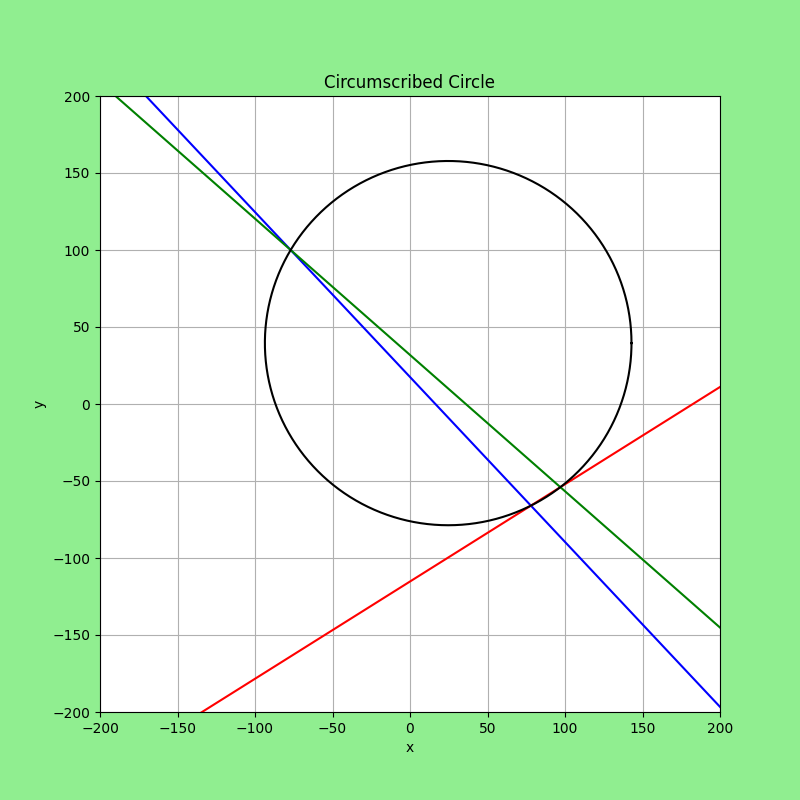

# Circumscribed_Circle

## Description
A program that given 3 random points on R2, validates them, graphs their lines and the circumscribed circle.

## Author:
Arnoldo Fernando Chue Sánchez

## Contact:
arnoldwork20@gmail.com

## License:
GNU General Public License v3.0

## Information about installation and execution
All the code was written in Python 3.10.7. Before cloning the repository, check if your Python version is compatible with this program.
Also, make sure to install (if you don't have them) all the modules that were used for this proyect (numpy and matplolib). 
After that, you just have to clone this repository on your local machine and run the archive named "Circumscribed_Circle.py" in the terminal of your preference.
You can run the program the number of times you want. But, it will generate different coordinate points every single time. That is the reason why I recommend saving every graph you get.

## Introduction
Triangles have multiple lines. Some of them are very useful for visualization and geometry applications. For example, altitude is useful for calculating the area of ​​a triangle. But, the line that will be helpful in this project is the perpendicular bisector.

A perpendicular bisector is a line that crosses one of the sides of the triangle at its midpoint. Also, (the bisector) is perpendicular to the side of the triangle. Therefore, since the triangle has three sides, it also has three perpendicular bisectors. Those bisectors converge at the same point: the circumcenter of the triangle. This point is fundamental because the distance between all the vertices of the triangle and the circumcenter is the same. Then, a circle is circumscribed when it is created with a radius of the mentioned distance, and its center is at the circumcenter.

Using these concepts and all the lessons in analytic geometry it is possible to find the circumscribed circle of any triangle. For this project, the corners of the triangle (the coordinate points) and its sides (segments of a straight line) are the most important components of a triangle.

## Objectives
- Create a set of functions which can construct the lines and the circumscribed circle from three random coordinate points.
- Plot the lines and circle in a good resolution and minimizing the margin of rendering error.

## Metodology
In this section, there will be a brief description of the algorithm used to construct the whole program. The details about how do the functions work is explained in the implementation section.

The description of each step is:
1. Create three random coordinate points. Before starting step 2, it is important to valided if the points are suceptible of ploted a triangle.
2. Create three lines with the coordinate points. Basically, it is about calculating the straight line equation for each line.
3. Calculate the midpoint for each line of the triangle. With the midpoints and the slopes of the sides, it is simple to calculate the equation of the perpendicular bisectors.
4. Find the intersection of the perpendicular bisectors. This is the circumcenter for the circumscribed circle.
5. Calculate the distance between the circumcenter and the corners of the triangle.
6. Create a circle with radius of the calculated distance (step 5) and center at the circumcenter.

## Implementation

## Tests and results
All the tests provided by the functions in the project run correctly. The random coordinate points were valided correctly. In some cases, the only problem was the scale: sometimes the points ploted very long triangles. In consequence, the circle is too big for the screen. So, the circles of some of the images look like ellipses.

Some of these test/results are the following:

*Test 1. Points: (-66, -56)  (16, -68)  (56, 26)*

*Test 2. Points: (-17, 22)  (-40, -89)  (74, -59)*

*Test 3. Points: (37, -93)  (-57, 5)  (-82, -5)*

*Test 4. Points: (-39, -63)  (-77, -6)  (29, -17)*

*Test 5. Points: (-40, -49)  (5, 53)  (91, 50)*

*Test 6. Points: (-98, 100)  (-69, -67)  (-4, 12)*

*Test 7. Points: (-54, 47)  (62, -65)  (70, -28)*

*Test 8. Points: (87, 81)  (47, 91)  (23, 90)*

*Test 9. Points: (-98, -90)  (-41, 96)  (75, -22)*

*Test 10. Points: (4, 39)  (2, 9)  (-87, 60)*

*Test 11. Points: (-40, 5)  (-2, 75)  (31, 39)*

*Test 12. Points: (-56, 60)  (12, 78)  (83, 45)*

*Test 13. Points: (-89, 81)  (66, -25)  (72, 68)*

*Test 14. Points: (13, 85)  (37, -70)  (53, 52)*

*Test 15. Points: (-77, 51)  (20, 11)  (37, 9)*

*Test 16. Points: (-63, -38)  (14, -63)  (60, 94)*

*Test 17. Points: (0, 43)  (27, 66)  (86, -27)*

*Test 18. Points: (-14, -23)  (13, -54)  (17, -51)*

*Test 19. Points: (77, -12)  (80, -2)  (72, -38)*

*Test 20. Points: (-77, 48)  (-60, -70)  (51, 61)*

## Conclusions
Working with random coordinate points can be hard beacause it is imposible to set a good scale for the render of all the executions. Nevertheless, the final result was a success. The render is fast and the curves are smooth enough. The margin of rendering error is close to 0.00001 between the points and the circle.
Future work can be focused on developing faster rendering tools and making statistics about the margin of rendering error

## References
1. Lehmann, C. H. (2014). Geometría analítica. Limusa.
2. Rees, P. K. (2003). Geometría analítica. Editorial Reverté.
