# Circumscribed_Circle

## Description
A program that given 3 random points on R2, validates them, graphs their lines and the circumscribed circle.

## Author:
Arnoldo Fernando Chue Sánchez

## Contact:
arfersan20@gmail.com

## License:
GNU General Public License v3.0

## Information about installation and execution
All the code was written in Python 3.10.7. Before cloning the repository, check if your Python version is compatible with this program.
Also, make sure to install (if you don't have them) all the modules that were used for this proyect (numpy and matplolib). 
After that, you just have to clone this repository on your local machine and run the archive named "Circumscribed_Circle.py" in the terminal of your preference.
You can run the program the number of times you want. But, it will generate different coordinate points every single time. That is the reason why I recommend saving every graph you get.

## Introduction
Triangles have multiple lines. Some of them are very useful for visualization and geometry applications. For example, altitude is useful for calculating the area of ​​a triangle. But, the line that will be helpful in this project is the perpendicular bisector.

A perpendicular bisector is a line that crosses one of the sides of the triangle at its midpoint. Also, (the bisector) is perpendicular to the side of the triangle. Therefore, since the triangle has three sides, it also has three perpendicular bisectors. Those bisectors converge at the same point: the circumcenter of the triangle. This point is fundamental because the distance between all the vertices of the triangle and the circumcenter is the same. Then, a circle is circumscribed when it is created with a radius of the mentioned distance, and its center is at the circumcenter.

Using these concepts and all the lessons in analytic geometry it is possible to find the circumscribed circle of any triangle. For this project, the corners of the triangle (the coordinate points) and its sides (segments of a straight line) are the most important components of a triangle.

## Objectives
- Create a set of functions which can construct the lines and the circumscribed circle from three random coordinate points.
- Plot the lines and circle in a good resolution and minimizing the margin of rendering error.

## Metodology
In this section, there will be a brief description of the algorithm used to construct the whole program. The details about how do the functions work is explained in the implementation section.

The description of each step is:
1. Create three random coordinate points. Before starting step 2, it is important to valided if the points are suceptible of ploted a triangle.
2. Create three lines with the coordinate points. Basically, it is about calculating the straight line equation for each line.
3. Calculate the midpoint for each line of the triangle. With the midpoints and the slopes of the sides, it is simple to calculate the equation of the perpendicular bisectors.
4. Find the intersection of the perpendicular bisectors. This is the circumcenter for the circumscribed circle.
5. Calculate the distance between the circumcenter and the corners of the triangle.
6. Create a circle with radius of the calculated distance (step 5) and center at the circumcenter.

### Equations
Before the implementation, it is necessary to mention which equations are used in each step of the algorithm.

First of all, each point will be described as (x, y). So, after having the three valid points, it is necessary to calculate their three straight line equations. Here is how it is done:

Where m is the slope of the line, b is the value of x when y is equals to 0, and the third equation is the way to calculate the straight line equation.

After that, it is necessary to work on the perpendicular bisectors (in order to calculate the coordinate points of the circumcenter). Then, the first equation is the one that calculates the perpendicular slope of the bisector having the slope of that side of the triangle.

This is the condition that determines if a line is perpendicular to other line. The program needs to calculate the slope of two of three perpendicular bisectors of the triangle. For doing that, it needs the three corners of the triangle.

After that, the following equation for the perpendicular bisectors is the one that calculates the value of b.

It is important to consider that in this case the values of x and y are not the coordinate points of the corners of the triangle. Instead, the values of x and y are the coordinates of the midpoint of one of the three sides of the triangle. The coordinates x and y of the midpoint are calculated by the following equations:

So, having the values of b and the values of the slopes of two perpendicular bisectors, it is possible to calculate the coordinates of the circumcenter without calculating the equations of the perpendicular bisectors. The equations are the following:

Where h is the equivalent of x and k is the equivalent of y for the coordinates of the circumcenter.

Finally, it is necessary to calculate the value of the radius of the circumscribed circle. Using the Euclidean norm it is possible to calculate the value of the radius of the circumscribed circle.

The two points used in this equation are the circumcenter and one of the corners of the triangle.

Then, using the circle equation it is possible to calculate the circumscribed circle.

Where r is the radius of the circumscribed circle and h and k are the coordinates of the circumcenter.

These are all the equations used in the functions that will be described in the next section.

## Implementation
In this section it is shown how do all the functions work. The order is the same as the order of the metodology section.

First of all, Python 3.10.7 was used for the whole program. The modules imported from this Python version were random, numpy and matplolib.

1. *createPoints* is the function that solves this step. It creates 3 random coordinate points (every point with integer numbers between -100 and 100) and validates them. When the points are valid, it returns the point in a list. The validation is done comparing the values of each coordinate point and their slopes.
2. *line* is the function that solves this step. It has two points as parameters. It is very similar than the functions used in class, but this one uses *b* (which is calculated with a simple equation based on the straight line equation) and *x* (global variable) which is built with numpy method *linspace* instead of *array*. In this case it is better to use *linspace* because the return of this function is more similar to the mathematical straight line equation.
3. Due to steps 3 and 4 in the section of metodology are all about the perpendicular bisector equation, this point includes more than one function: the first one is the *middlePoint* function. It has two coordinate points as parameters and returns the coordinate point that is on the middle of both points. The second function is the one that will be called for getting the perpendicular bisector equation (*mediatriz*) or the circumcenter can be computed directly with the *center* function. In the case of using the *mediatriz* function, it is just necessary to use two of the three corners of the triangle. The function will calculate the midpoint of the segment, the inverse slope, and the value of b. It will return the perpendicular bisector equation. In the other hand, the function *center* function needs the three corners of the triangle as parameters. It also calculates the midpoint of two segments, their inverse slope, and the value of both b's. With all of these data, the function can return the coordinate of the circumcenter. Then, the function *center* is the one that will be used in the main function: it does the work of step 3 and 4 in one step.
4. Now that the circumcenter is known, the function *euclideanNorm* will return the distance between any corner of the triangle and the circumcenter. It calculates the Euclidean norm with Python operators, none numpy functions were necessary for this step.
5. The last step is to plot the circumscribed circle. *createCircle* is the function that will be called for this work. It has two parameters: the radius of the circle and the coordinate point of its center (circumscenter). It returns the values of x and y in order to plot the circumscribed circle easily. This function has particular variables: *segment* is the number of segments that will be used to plot the circumscribed circle or *angle* is way of determining the angle of the circle using numpy method linspace. It is important to note that this function does not return the circle as a function (because the circle equation is not a function by itself).
6. Finally, the main function computes all of the steps above (it calls all the functions mentioned). At the end of the function the execution is complete with the rendering (matplolib is used to draw every step in this function).

These are the functions that complete all the steps above. All the code is on the Circumscribed_Circle.py file.

## Tests and results
All the tests provided by the functions in the project run correctly. The random coordinate points were valided correctly. In some cases, the only problem was the scale: sometimes the points ploted very long triangles. In consequence, the circle is too big for the screen. So, the circles of some of the images look like ellipses.

Some of these test/results are the following:
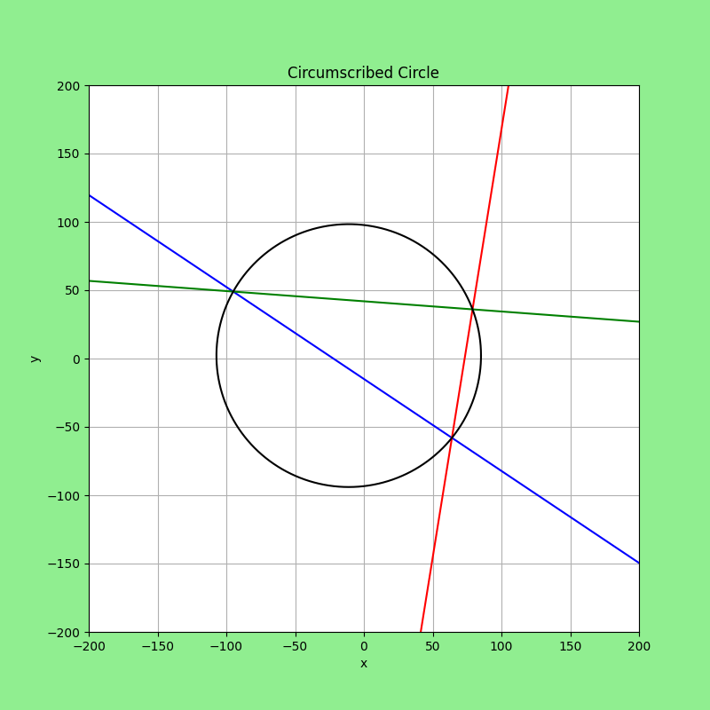
*Test 1. Points: (5, -5)  (53, -34)  (-74, 7)*

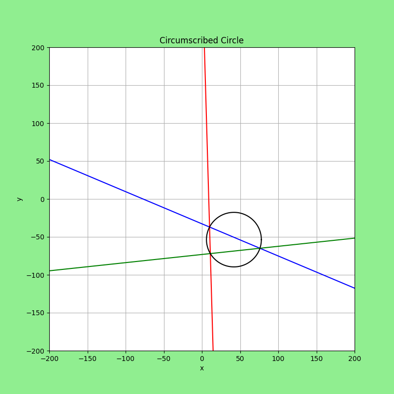
*Test 2. Points: (-95, 99)  (-60, -56)  (-10, -28)*

*Test 3. Points: (-67, 40)  (-45, -71)  (5, 95)*

*Test 4. Points: (-63, 93)  (-26, 50)  (88, 24)*

*Test 5. Points: (-57,-43)  (-35, -91)  (90, -42)*

*Test 6. Points: (-81, -23)  (-13, 17)  (2, 21)*

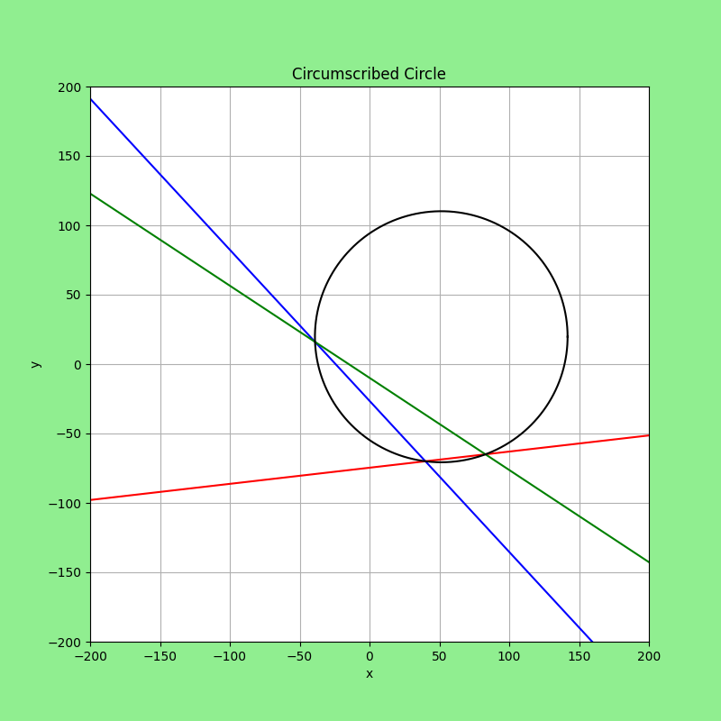
*Test 7. Points: (-54, 96)  (-58, -75)  (-35, -29)*

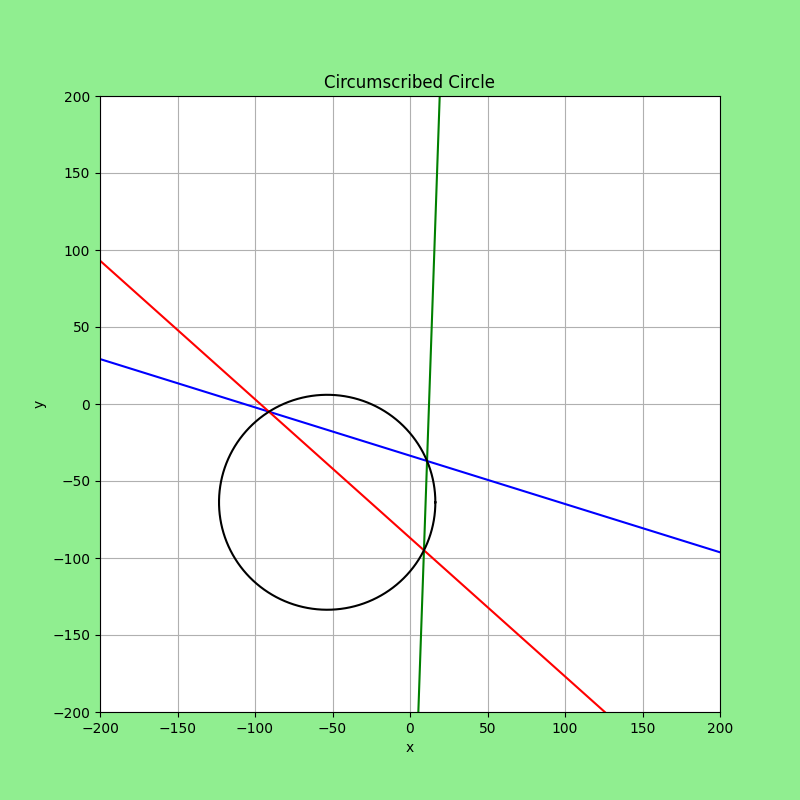
*Test 8. Points: (-63, -51)  (58, -79)  (89, -59)*

*Test 9. Points: (21, -38)  (35, -7)  (70, 7)*

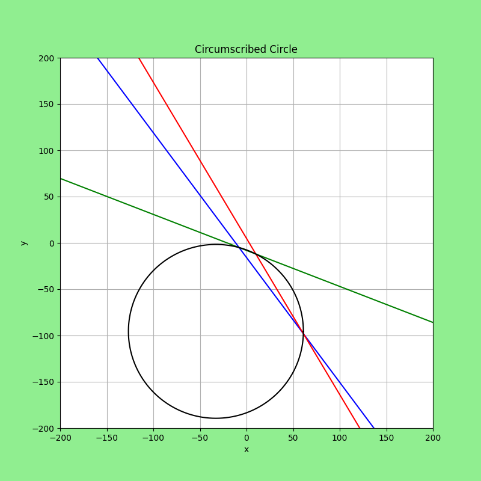
*Test 10. Points: (-88, -81)  (-24, -43)  (9, -57)*

*Test 11. Points: (-85, -6)  (22, -83)  (44, 95)*

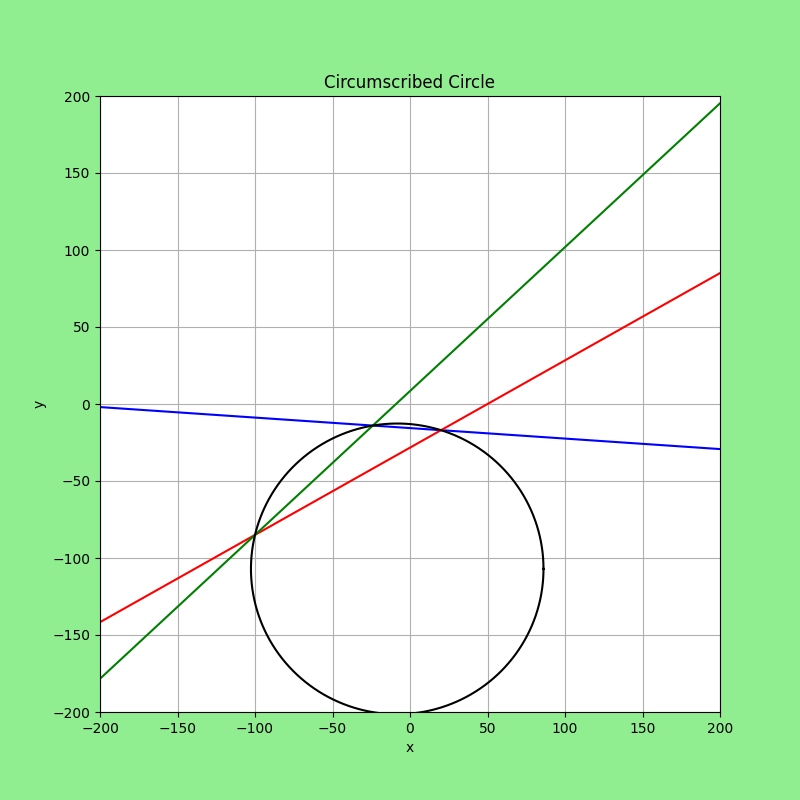
*Test 12. Points: (48, -84)  (87, -66)  (96, 48)*

*Test 13. Points: (-56, 13)  (-58, -29)  (40, -83)*

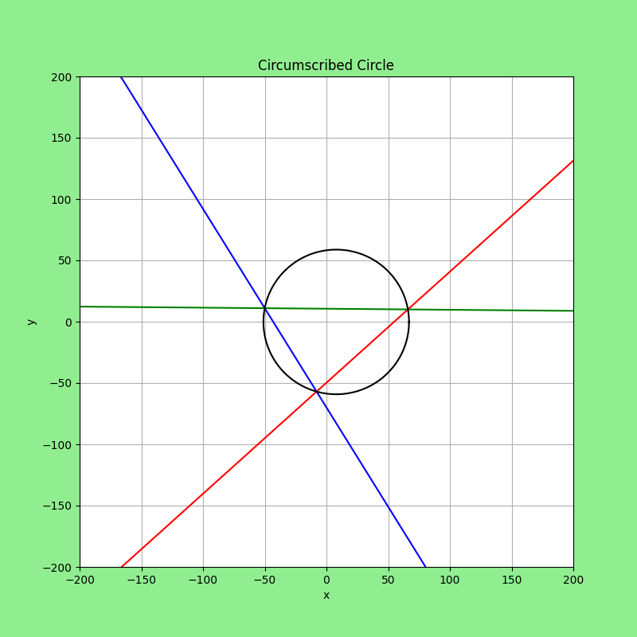
*Test 14. Points: (-43, 82)  (-17, 52)  (53,30)*

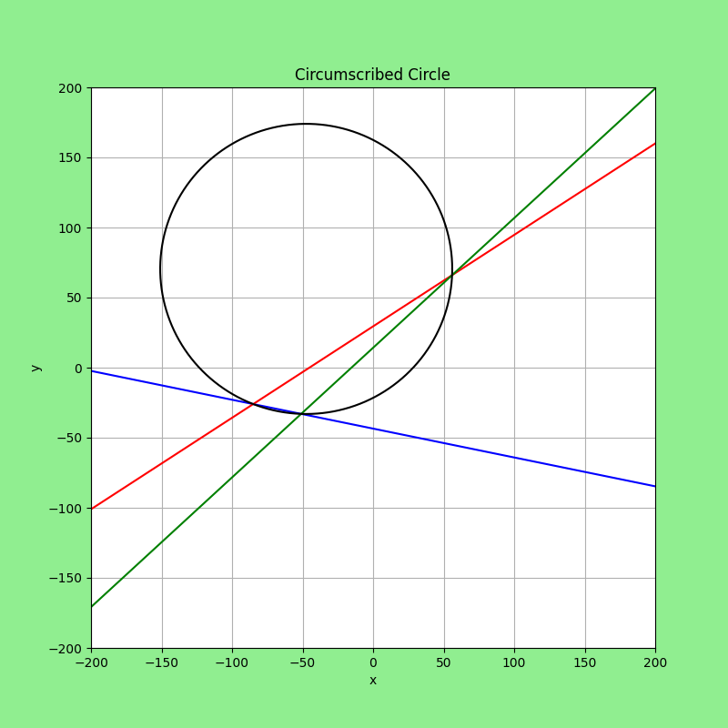
*Test 15. Points: (-1, -33)  (22, 23)  (44, -18)*

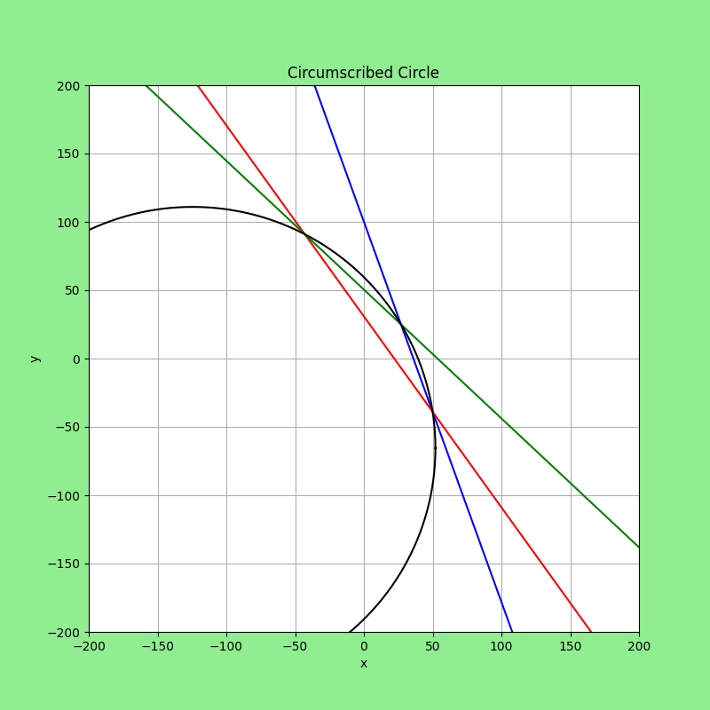
*Test 16. Points: (-79, -3)  (-33, -39)  (4, -36)*

*Test 17. Points: (-19, -29)  (0, -4)  (28, 70)*

*Test 18. Points: (-41, 47)  (17, -87)  (22, 11)*

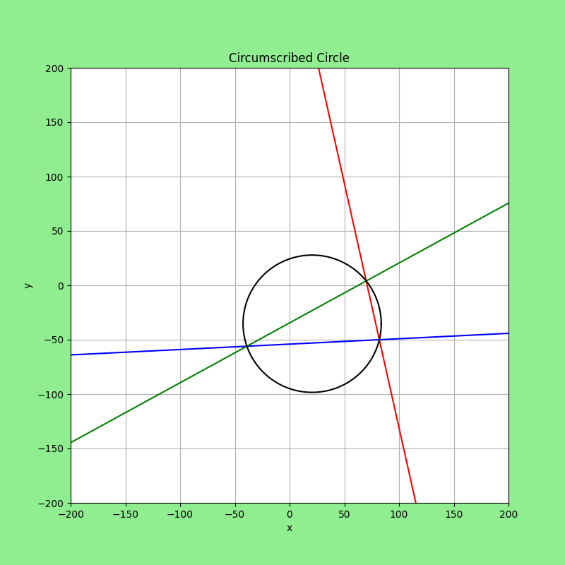
*Test 19. Points: (-92, -83)  (-36, -1)  (70, 74)*

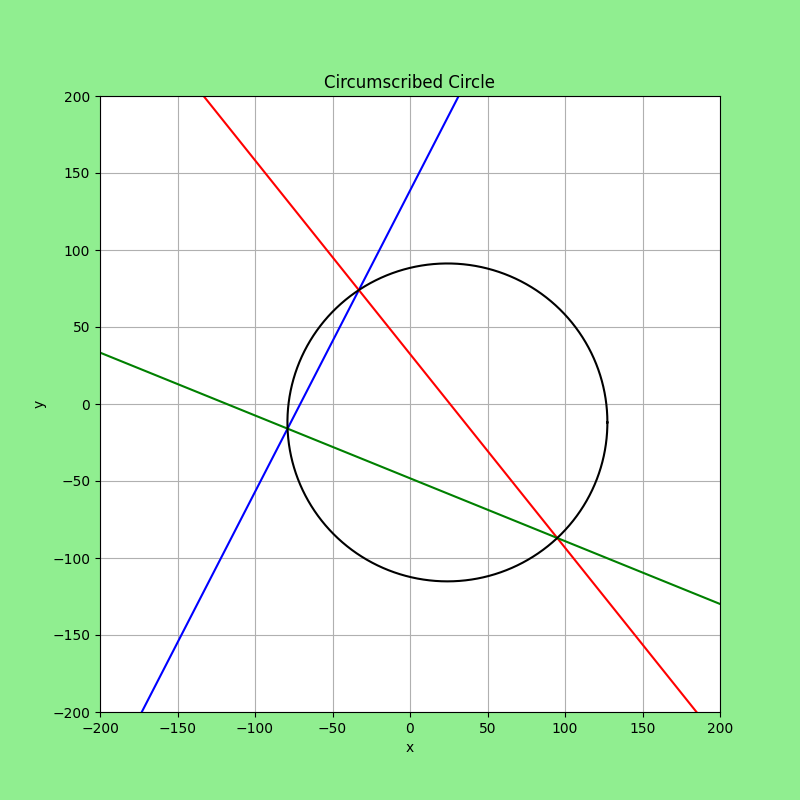
*Test 20. Points: (-64, -55)  (-18, 58)  (44, -82)*

## Conclusions
Working with random coordinate points can be hard beacause it is imposible to set a good scale for the render of all the executions. Nevertheless, the final result was a success. The render is fast and the curves are smooth enough. The margin of rendering error is close to 0.00001 between the points and the circle.
Future work can be focused on developing faster rendering tools and making statistics about the margin of rendering error

## References
1. Lehmann, C. H. (2014). Geometría analítica. Limusa.
2. Rees, P. K. (2003). Geometría analítica. Editorial Reverté.
